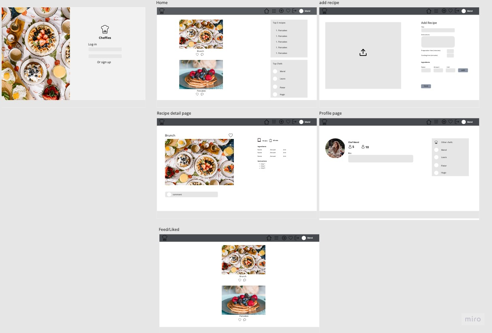

#Cheffies

Welcome,

In this document I will explain the reason and approach behind the Cheffies app. Imagine this, you just came home from work, you look in the fridge and it's completely empty. You ask your partner what he or she wants to eat but they don't know. You also don't have any inspiration and therefore you just start browsing while hungry. Wouldn't it be so much nicer to get recipe inspiration from someone who you know has the same taste? A one stop shop of recipes where each day new recipes are added? In addition, you might also be a cooking inspiration to others, so make sure you share your recipes as well!

Cheffies is an application where users can create their own online recipes while also being able to see the recipes of other users. Via commenting and likes the users can engage with each other and share their recommendations.

The last update to this file was: **March 16, 2023**

# Deployed project
The app can be accessed via the following link: [Click to go to Website](https://cheffies.herokuapp.com/) 

## Repository

[Find the project repository here.](https://github.com/MerelMoehn/cheffies)

# Table of Contents

## Contents
- [General introduction and instructions](#general-introduction-and-instructions)
  * [Project Approach](#project-approach)
  * [Epics & labels](#epics-&-labels)
  * [Project Planning](#project-planning)
- [User stories](#user-stories)
- [Features](#features)
  * [Future Features](#future-features)
- [Design & wireframing](#design-&-wireframing)
  * [Colourscheme](#colourscheme)
  * [WireFrames](#epics-&-labels)
  * [Typography](#typograpy)
  * [Cards](#icons)
  * [Icons](#cards)
  * [Imagery](#imagery)
- [Data Model](#the-data-model)
- [Technology Used](#technology-used)
  * [Languages used](#languages-used)
  * [Frameworks & Libraries used](#frameworks-and-libraries-used)
- [Testing](#testing)
  * [Validators](#validators)
    * [Lighthouse](#lighthouse)
    * [W3C CSS validator](#w3c-css-validation)
  * [Manual Testing](#manual-testing)
  * [Automated Testing](#automated-testing)
  * [Bugs found and solved](#bugs-found-and-solved)
    * [Unsolved bugs](#unsolved-bugs)
- [Deployment](#deployment)
  * [Heroku](#heroku)
  * [ElephantSQL](#elephantsql)
  * [Creating a local clone](#creating-a-local-clone)
- [Credits](#credits)
  * [Code](#code)
    * [Code Institute](#code-institute)
    * [Bootstrap](#bootstrap)
  * [Acknowledgments](#acknowledgements)

# General introduction and instructions

## Project Approach
This application is built using an agile approach. Therefore, the functionalities were broken down into Epics & User stories, and these picked up in three sprints. Each sprint consisted of two weeks. 

## Epics & labels
The application features were broken down into Epics and hence in User Stories. 
For each User Story, an issue was created. The corresponding Epic was depicted via a label.
There were two additional labels: Front-End, Back-End. For each User Story it was often the case that there were some BE and FE functionalities. Therefore, most User Stories were split into two User Stories, one for BE, one for FE.

[All Epics/labels can be viewed here.](https://github.com/MerelMoehn/cheffies/labels)
The following Epics were defined:
- Navigation & authentication - all stories related to account management
- Adding & viewing recipe - all stories related to creating and viewing a specific recipe
- The recipe page - all stories related to a specific recipe page
- Adding & viewing ingredients - all stories related to creating and displaying ingredients
- Showing & searching recipes - all stories related to displaying multiple recipes and searching for a recipe
- Commenting - all stories related tot creating, deleting, and editing comments
- Like/Unlike recipe - all stories related to like and unlike
- (un)following - all stories related to being able to (un)follow a specific user
- User profiles - all storiess related to displaying a user profile
- Documentation - all stories related to documentation
- Bugs

## Project Planning
The project was planned and built in four sprints each consisting of one week. The project tool used was GitHub Projects & Issues. The issues were mapped on a kanban board using labels and swimming lanes.

When I started working on an User Story, the story was added to the milestone and dragged and dropped into "in progress", when finished, the story was dragged & dropped into the "done" lane.
To clarify, I only noticed when having finished 95% of my project that setting a story to 'done' did not close the story. Therefore most of the stories have the same closing date.

I decided to focus on creating the main back-end functionalities first before focusing on front-end. This decision was made based on the availability of support during the Christmas holidays. 

[View stories/bugs included in sprint 1.](https://github.com/MerelMoehn/cheffies/milestone/1?closed=1)
[View stories/bugs included in sprint 2.](https://github.com/MerelMoehn/cheffies/milestone/2?closed=1)
[View stories/bugs included in sprint 3.](https://github.com/MerelMoehn/cheffies/milestone/3?closed=1)

# User stories

In the table below is an overview of the User Stories. 

The total number of issues (including bugs) created are: 41

| User Story ID | As a/an | I want to be able to... | So that I can... |
| --- | ----------- | ----------- | ----------- |
 | [Authentication & navigation](https://github.com/MerelMoehn/cheffies/issues?q=label%3A%22Navigation+%26+Authentication%22+is%3Aclosed) | 
 | 1 |  User | view a navbar from every page | navigate easily between pages  | 
 | 2 | User | navigate through pages quickly | view content seamlessly without page refres | 
 | 3 | Unregistered user | create a new account | that I can access all the features for signed up users | 
 | 4 | Logged-out user | sign in to the app | access functionality for logged in users | 
 | 5 | Logged-in user | As a user I can tell if I am logged in or not| log in if I need to | 
 | 6 | Logged-out user | see sign in and sign up options| I can sign in/sign up | 
 | 7 | Logged-in user | maintain my logged-in status until I choose to log out| that my user experience is not compromised | 
 | 8 | User | view user's profile picture| easily identify users of the application | 
  | [Adding & Viewing Recipe](https://github.com/MerelMoehn/cheffies/issues?q=is%3Aissue+sort%3Acreated-asc+label%3A%22Adding+%26+Viewing+Recipe%22+is%3Aclosed) | 
 | 9 | Logged-in user | I can create recipes | share my recipes with the world! | 
 | 10 | Logged-in user  | view the details of a single recipe | learn more about it| 
  | [Manage Bookcase](https://github.com/MerelMoehn/favoreads/issues?q=label%3A%22Manage+Bookcase%22+is%3Aclosed) | 
 | 14 | Registered User | Update the reading status of my book | Show others an up to date bookcase | 
 | 15 | Registered User | Delete a book out of my bookcase | Show others an up to date bookcase |
 | 16 | Registered User | Automatically add a submitted book to my bookcase | So that I don't have to do this manually |
 | 17 | Registered User | See a confirmation message of my action | So that I know what is happening |
 | [Account Management](https://github.com/MerelMoehn/favoreads/issues?q=label%3A%22Account+management%22+is%3Aclosed) | 
 | 18 | Unregistered User | Easily register for an account | Join this book community | 
 | 19 | Registered User | Easily login or logout | View bookcases, upload books, and manage my bookcase | 
 | 20 | Registered User | Easily recover my password | Access my account even if I've forgotten my password | 
 | 21 | Unregistered User | Get an impression of the application from the homepage | Understand what the project is about | 
  | [Project Prerequisites](https://github.com/MerelMoehn/favoreads/issues?q=label%3A%22project+prerequisites%22+is%3Aclosed) | 
 | 22 | Developer | Set up my project | Build the base layout of my application |
 | 23 | Developer | Create the Data Models | Support my application with data | 
 | 24 | Developer | Deploy my application early | Check frequently if everything is working properly | 
 | 25 | Developer | Create automated tests | Ensure a reliable application | 
 | 26 | Developer | Create understandable code via commenting | Help other developers understand it |
  | [Documentation](https://github.com/MerelMoehn/favoreads/issues?q=label%3Adocumentation+is%3Aclosed) |
| 27| Developer | Create Wireframes | Ensure my application is properly designed | 
| 28 | Developer | Create a LucidChart Data Model | Ensure my Data Models are designed & documented correctly | 
| 29 | Developer | Document in a ReadMe file | Ensure my application is documented correctly & sufficiently | 

# Features
This application has several features which I will highlight per page.

- On the 'Home' page the logged-out user can make use of the following features:
  - Register
  - Log-in
  - Log-out
  - See the recipes that are on the site
  - Click on a selected recipe and go to its detail page
  - See the top 5 recipes with the most likes
  - See the top 10 most popular chef's based on their followers
  - Go to the detail page of a specific user
- A logged-in user on the 'Home' page can make us of the following features:
  - All the functionalities named above
  - Search for a recipe based on username, recipe name, ingredient
  - Like a recipe, if the user is not the owner of the recipe
  - Select the 'add' button to add a recipe
  - Navigate to 'Feed' to see all the posts of the users they are following
  - Navigate to 'Liked' to see all the posts they liked
- A logged-in user on a specific 'Recipe' page can make us of the following features:
  - See the ingredients that are needed for that recipe
  - Seethe instructions that need to be followed for that recipe
  - See the comments that are placed by that recipe 
  - Like a recipe, if the user is not the owner of the recipe
  - Comment on a recipe, if the user is not the owner of the recipe
  - Adjust the recipe, if the user is the owner of the recipe
  - Adjust a comment, if the user is the owner of the comment
  - A logged-out user cannot see the comments
- On the 'Add Recipe' page a logged-in user can make use of the following features:
  - Add a picture of the recipe (note, it is an outstanding bug that a picture needs to be uploaded, its not optional)
  - Add the title of the recipe
  - Add the instructions of the recipe
  - Add the category of the recipe
  - Add the cooking & preparation time of the recipe
  - Cancel the creation of the recipe
  - Go to the next step to add ingredients
- On the 'Add Ingredients' page a logged-in user can make use of the following features:
  - See a summary of the recipe
  - Add a name of the specific ingredient
  - Add the amount required of an ingredient
  - Select the unit measurement of an ingredient
  - See all the previously added ingredients
- On the profile page a user can make use of the following features:
  - See the Name, Bio and Profile picture of that user profile
  - See the statistics regarding followers, following and amount of posts
  - See all the posts of that user
  - See the popular profiles

## Future Features
The following features would be nice to add in the future:

- Mealplan: allow users to add recipes they want to include in a mealplan
- Grocery list: allows users to automatically generate a grocerylist based on the recipes in their mealplan
- Add advanced filter: add filters such as vegetarian, meat, and fish to let the user do an advanced search

# Design & wireframing
## Colourscheme
The design of the Cheffies application is based on the image below. Four colours are extracted and used for the main elements on the page. 
* Color for o.a. NavBar: #1a1a1a
* Color for o.a. buttons: #8f8e49
* Color for background and white text: #f9f9f9
* Color for background Popular Profiles and Icons: #E6E6E6

## WireFrames
[Click here for related user story.](https://github.com/MerelMoehn/cheffies/issues/34)
The wireframes created for this project were made in the online tool Miro. 

The wireframes were used as a rough sketch of what the application was meant to do and look like. This included the page navigation, the different pages needed, and a rough sketch of the design.
After initial set up of the main features the design was further implemented based on the design as described above.

## Typography

- The typography used within the application is the following font-family: Roboto, sans-serif. These fonts were used because they are a fairly safe and modern choice and do not distract the attention from the books. 

## Icons
- I used icons from Font Awesome website. They are used on the index page to depict the three main features of the website.

## Imagery 
- Imagery is used to give the application a more sophisticated look and to make it feel like an actual online recipe platform.
- Recipe images uploaded by the user are mostly displayed within React Bootstrap cards.
- The images used have been downloaded from Unsplash.com

# Data model
The data model used for this project is implemented in Cheffies-API. 
Please refer to the ReadMe of the API for the data model.
[Click here for the data model](https://github.com/MerelMoehn/cheffies-api/blob/main/README.md)

# Technology used
## Languages used
- [HTML5](https://en.wikipedia.org/wiki/HTML5)
- [CSS](https://en.wikipedia.org/wiki/CSS)
- [ReactJS](https://en.wikipedia.org/wiki/CSS)
- [JavaScript](https://en.wikipedia.org/wiki/JavaScript)
- [Python](https://en.wikipedia.org/wiki/Python_(programming_language))

## Frameworks & Libraries used
- [React Bootstrap 4](https://react-bootstrap.github.io/) 
  - I used React bootstrap throughout the site to make it responsive. I sourced code from the Bootstrap documentation when building the Navbar, Cards, Badges, Containers and Buttons.

- [Google Fonts](https://fonts.google.com/)
  - Fonts are imported from google fonts.
  
- [Font awesome](https://fontawesome.com/)
  - I used icons from font awesome on the index page.

- [Cloudinary](https://cloudinary.com/)
  - I used images that were stored on Cloudinary.

# Testing
## Validators
### Lighthouse
Each site page has been checked with Lighthouse and the following improvements have been made:
* Using smaller images to load page faster
* include meta tag on base.html
* Language has been set in base.html
* Non unique ARIA IDs are made unique
* Remove big layout shift with buttons for user bookcase
For pages that are not rendering images, all indicators are green. However, uploading images with different sizes decreases the performance score.

### W3C CSS Validation
The style.css code has been validated by the W3C CSS validator and passed without any errors.

## Manual Testing
Note that I am referring to manual testing after the main development stage was finished. Bugs found during development were handled immediately. 

Each user story is tested for acceptance. These testcases and screenshots can be seen in each individual userstory. 
Take a look at the following user story as example: [Add Ingredients](https://github.com/MerelMoehn/cheffies/issues/31)

## Automated testing
For each of the components there are automated test, though on a basic level.
All tests pass. 

## Bugs found and solved
Throughout the project there were multiple bugs found and solved. These bugs were logged on the GitHub project and can be reviewed via the following link: [Click here to review the bugs.](https://github.com/MerelMoehn/cheffies/issues?q=label%3Abug+is%3Aclosed) 

### Unsolved bugs
At the moment of submitting and deployment, there is one unresolved bug which is about being unable to submit a recipe without an image. After contact with the tutors it became clear this was also an outstanding bug in the Moments project.

# Deployment
## Heroku
The project was deployed to Heroku using the following steps:
1. I pushed my final code via the terminal after finishing the project.
2. I created a new Heroku app
3. I linked the Heroku app to the repository
4. I pushed my final code via the terminal after finishing the project.
5. Then I selected 'deploy'

## ElephantSQL
The database was set up by following the steps beneath:
1. Log in to ElephantSQL.com to access your dashboard
2. Click “Create New Instance”
3. Set up your plan
4. Select “Select Region”
5. Select a data center near you
6. Then click “Review”
7. Check your details are correct and then click “Create instance”
8. Return to the ElephantSQL dashboard and click on the database instance name for this project
9. In the URL section, click the copy icon to copy the database URL
10. The proper steps were taken in the settings.py file to connect with the database.

## Creating a local clone
You can create a local clone of the repository via the following steps:
1. navigate to the main page of the repository
2. download the code
3. Copy the URL for the repository.
4. Open Terminal
5. Change the current working directory to the location where you want the cloned directory.
6. Type git clone, and then paste the URL you copied earlier.
7. Press Enter to create your local clone.

For more detailed instructions, navigate to the following page:
https://docs.github.com/en/repositories/creating-and-managing-repositories/cloning-a-repository

# Credits
## Code
### Code Institute:
  - I based the set up of this project on the Code Institute Moments walkthrough project. I have customised my website wherever possible. Customization is especially visible with respect to the recipes, ingredients and popular recipe section.

### Bootstrap:
  - I have used Bootstrap classes throughout my project, including for layout utilities and cards. I sourced code from the Bootstrap documentation when building the Navbar, Cards, Dropdown, and pagination.

## Icon
The Icon has been made by Iconixar and I got it from https://www.flaticon.com/free-icon/chef_2413341?related_id=2413004&origin=search

## Acknowledgements
- Thank you to my mentor for helpful feedback, industry insights and recommended tools.

- Thank you to the tutors and staff at Code Institute for their support.

Thank you!